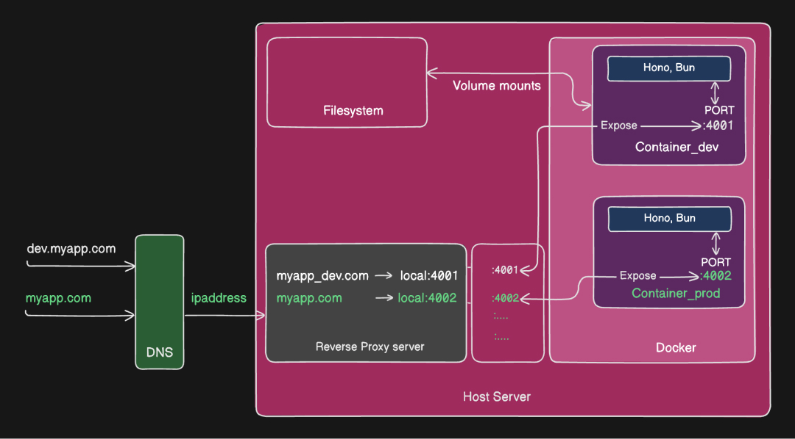

# RK Awesome Docker Compose 

A curated collection of Docker Compose examples and related resources.

These examples provide a foundation for integrating multiple services using a Compose file and managing their deployment with Docker Compose. Additional resources such as articles, books, and videos are included to help deepen your understanding of the concepts.

Note: The following examples are designed for use in local development environments, such as project setups or experimenting with software stacks.

## Contents

1. [Docker compose samples](#docker-compose-sample)
   - [Multi service architecture](#multi-service-architecture)
     - [Architecture_1](#architecture_1) - Frontend (nextjs)/Backend_1 (fastify,node,mongo)/Backend_2 (hono bun)
   - [Single service architecture](#single-service-architecture)
     - [`Hono / BUN`](#hono-/-bun)
2. [Articles](#articles)
   - [Freecodecamp](https://www.freecodecamp.org/news/tag/docker-compose/)
   - [Introduction to Docker Compose](https://www.baeldung.com/ops/docker-compose)
   - [How to Set up Docker Compose: Step-By-Step Tutorial](https://medium.com/@kaaiot/how-to-set-up-docker-compose-step-by-step-tutorial-9c339df67a2d)
3. [Videos](#videos)

   - [Docker Compose will BLOW your MIND!! (a tutorial)](https://www.youtube.com/watch?v=DM65_JyGxCo&t=13s&pp=ygUNZG9ja2VyY29tcG9zZQ%3D%3D)
   - [Ultimate Docker Compose Tutorial](https://www.youtube.com/watch?v=SXwC9fSwct8)
   - [Master Docker Compose the Way I Wish I Did – Docker for Newbs EP 2](https://www.youtube.com/watch?v=HGKfE-cn9y4)
   - [Docker Compose Tutorial](https://www.youtube.com/watch?v=HG6yIjZapSA)

4. [Books](#books)
   - [Learning docker-compose eBook (PDF)](https://riptutorial.com/ebook/docker-compose) - Free
   - [A Developer's Essential Guide to Docker Compose: Simplify the development and orchestration of multi-container applications](https://www.packtpub.com/en-us/product/a-developers-essential-guide-to-docker-compose-9781803234366?srsltid=AfmBOoqSt9Hv_v-1HDcr-4TEyBTv_MUYF7LteNGfKya1MS9AxtXU9Xam) - Paid
5. [Cheatsheets](#cheatsheets)
   - [The Ultimate Docker Compose Cheat Sheet](https://devopscycle.com/blog/the-ultimate-docker-compose-cheat-shee)
   - [docker-compose cheatsheet](https://devhints.io/docker-compose)

## Docker compose Samples

### Single service architecture

#### Hono / BUN

A simple Hono API micro service app running on Bun.

View Source: [hono-bun](single-service/hono-bun)

- Architecture Overview:

- Backend Api - Hono, Bun

### Multi service architecture

### Architecture_1

A multi micro service app contains

View Source : [architecture-1](multi-service/architecture-1)

- Architecture Overview:

- Frontend UI - Nextjs, Node
- Backend API-1 - Hono, Bun
- Backend API-2 - Fastify, Node, Mongodb

